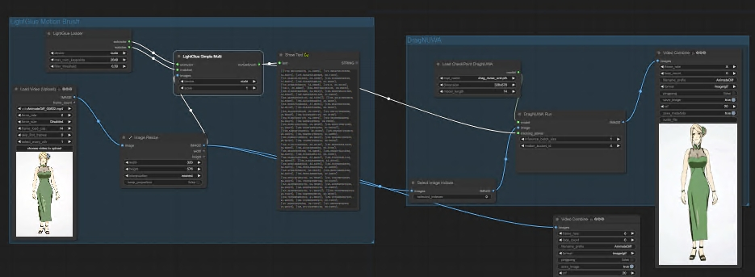

# This is an ComfyUI implementation of LightGlue to generate `MotionBrush` for DragNUWA

[LightGlue](https://github.com/cvg/LightGlue)

## Install

1. Clone this repo into custom_nodes directory of ComfyUI location

2. Run pip install -r requirements.txt

## Examples

video workflow

https://github.com/chaojie/ComfyUI-LightGlue/blob/main/workflow_video.json

LightGlueMotionBrush & DragNUWA

https://github.com/chaojie/ComfyUI-LightGlue/blob/main/workflow_lightgluemotionbrush.json
